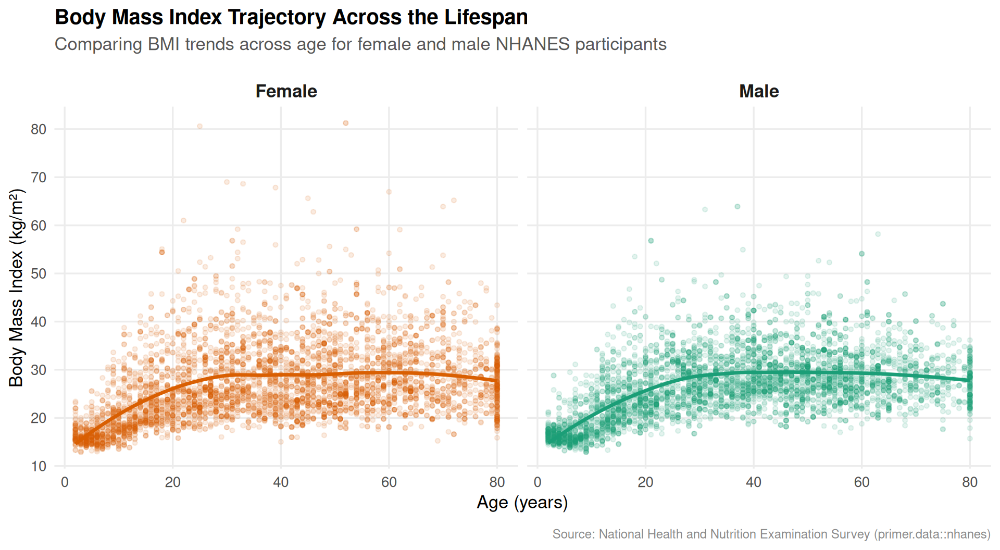

The **National Health and Nutrition Examination Survey (NHANES)** assesses the health and nutritional status of adults and children across the United States.

::: {.cell layout-align="center"}
::: {.cell-output-display}
{fig-align='center' width=960}
:::
:::

### Key Observations

- **Childhood to Early Adulthood:** BMI increases sharply from childhood into the twenties as individuals grow.
- **Middle Adulthood:** BMI levels tend to plateau between ages 30 and 60, with the average hovering in the 28–30 kg/m² range.
- **Later Decades:** The trend line stabilizes and gently tapers downward in older age, following comparable paths for both males and females.

